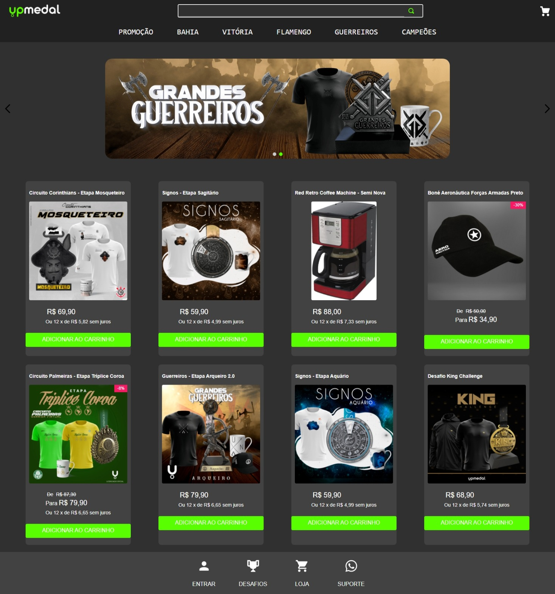

<h1 align="center">👕 Site para a empresa UpMedal</h1>

  <strong>Desafio 3 do Hiring Coders 2 - VTEX </strong>
   
  Criação de um site utilizando VTEX IO - plataforma de desenvolvimento empresarial de baixo código

  

## Biblioteca: 📙
- VTEX IO

